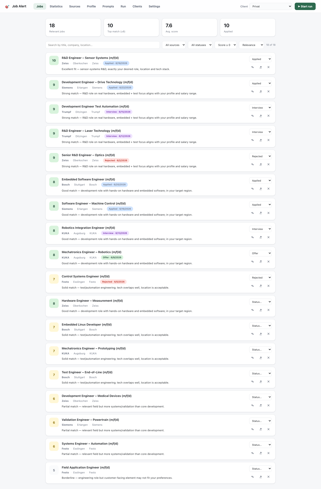
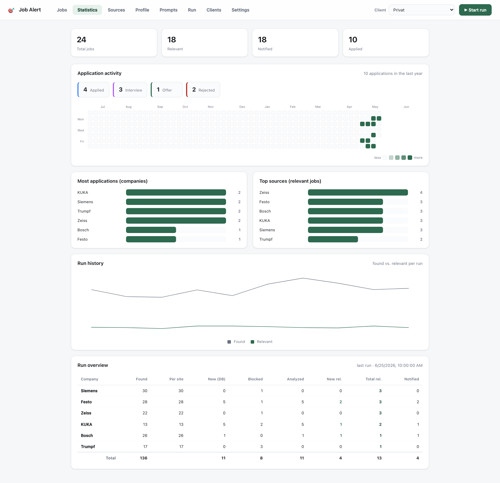
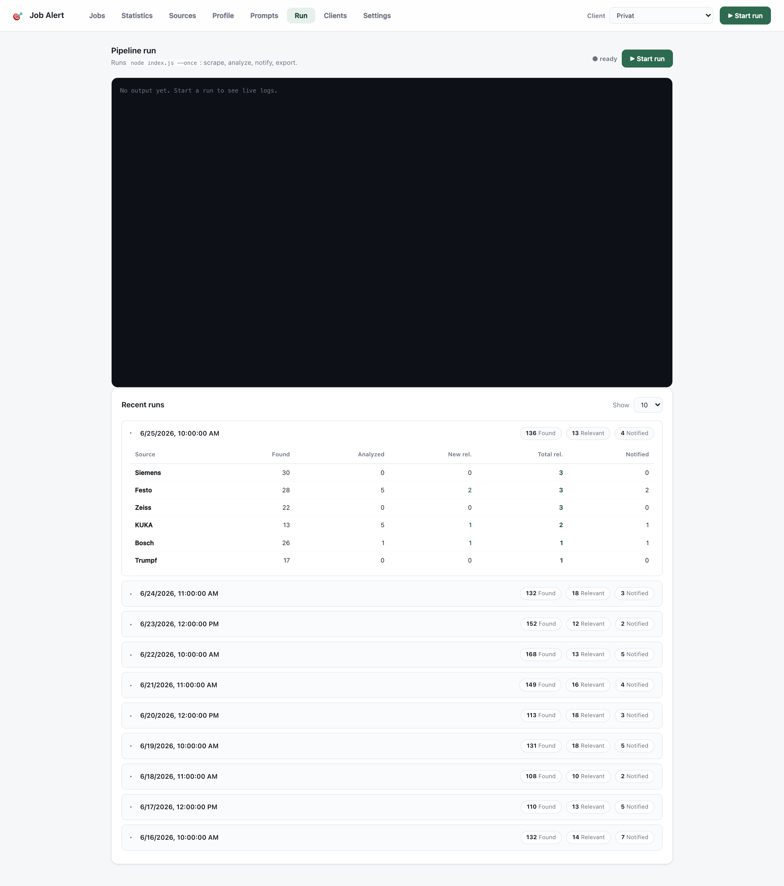
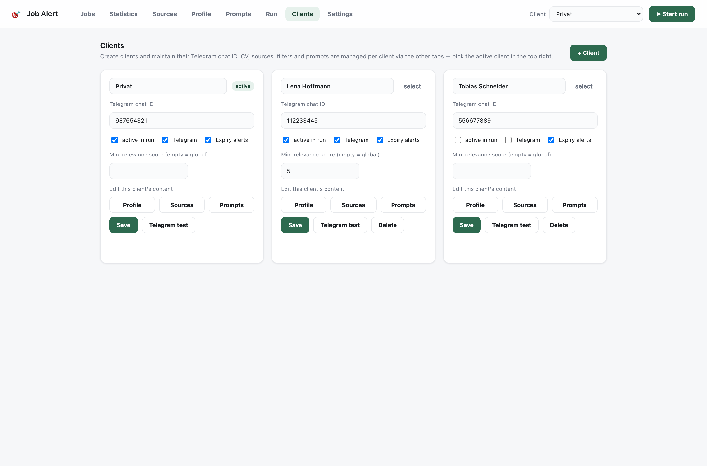
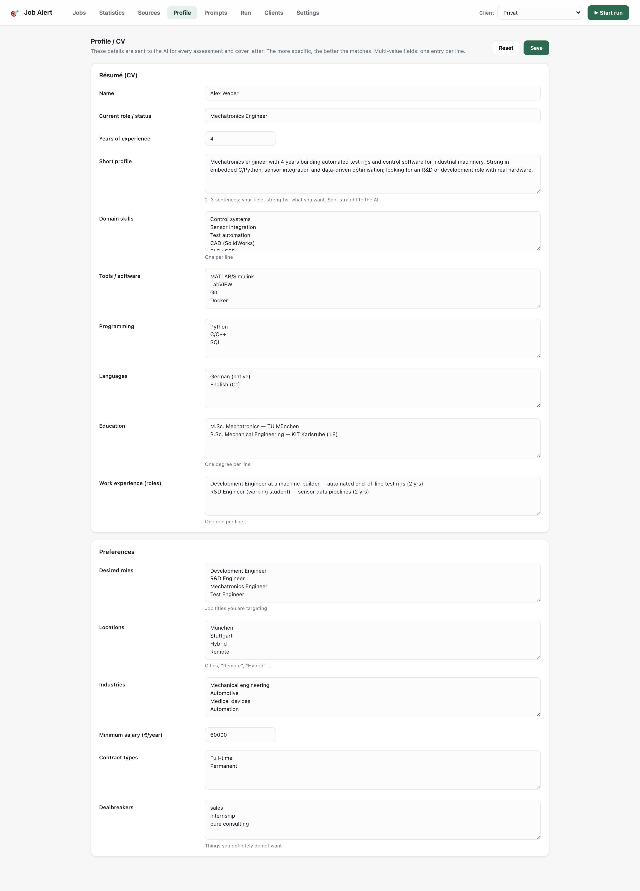
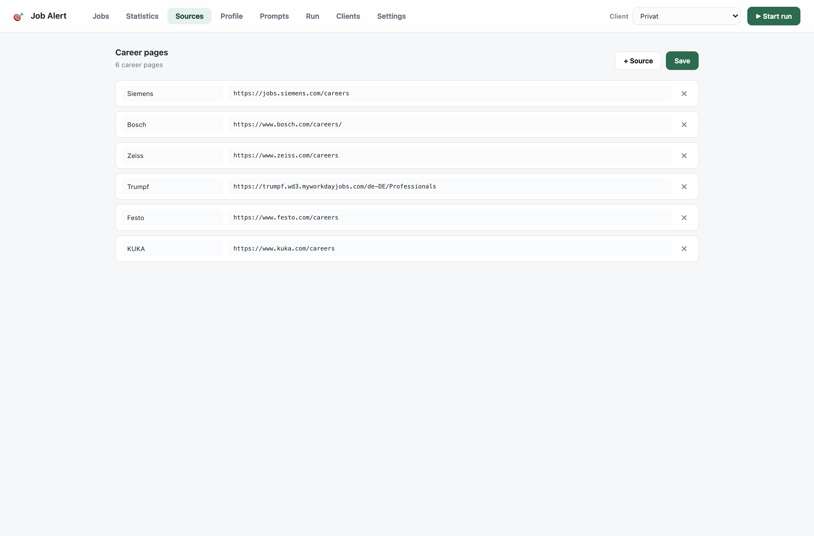
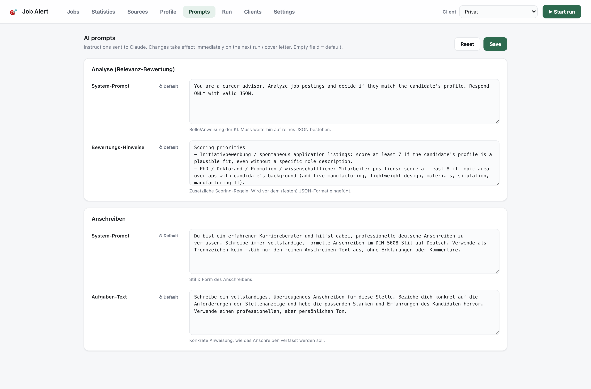
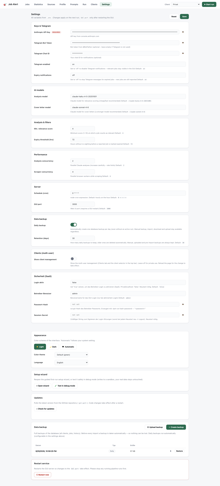

# Job Alert System

Automatically scrapes job boards, uses Claude AI to check relevance against your profile, sends matching jobs to Telegram, and tracks your applications.

**Multi-tenant ready.** The same codebase runs as a single-user tool *and* as a multi-client SaaS — the difference is configuration only, never a fork. Private use is simply one default client ("Privat"); an operator can create many **clients (Klienten)**, each with its own CV, sources, filters, prompts and Telegram chat id, sharing one Anthropic key and one Telegram bot. See [DEPLOY.md](DEPLOY.md) for the SaaS deployment (Docker + NGINX/Authelia).

## Screenshots

The web GUI (`npm run gui`) — browse matches, track applications, edit sources/profile/prompts, and trigger runs from the browser. *(Screenshots use throwaway sample data, not a real profile.)*

| Jobs — scored matches with live filters | Statistics — activity heatmap & charts |
|---|---|
| [](docs/screenshots/jobs.png) | [](docs/screenshots/stats.png) |

| Run — live pipeline log & run history | Clients — multi-tenant management |
|---|---|
| [](docs/screenshots/run.png) | [](docs/screenshots/clients.png) |

| Profile — CV & preferences the AI matches against | Sources — career pages to watch |
|---|---|
| [](docs/screenshots/profile.png) | [](docs/screenshots/sources.png) |

| Prompts — editable AI instructions per client | Settings — every option from a form |
|---|---|
| [](docs/screenshots/prompts.png) | [](docs/screenshots/settings.png) |

## Architecture

```
index.js                  ← --once [--client <id>] or hourly scheduler
└── src/scheduler.js      ← runAll(): loops enabled clients, runs the pipeline per client
    ├── src/scraper.js    ← Playwright scraper (DOM + API interception, 3 pagination strategies)
    ├── src/database.js   ← SQLite — clients table + per-client jobs (client_id), dedup, tracking
    ├── src/client-config.js ← resolves a client's profile/sources/filters/prompts (DB, legacy fallback)
    ├── src/analyzer.js   ← Claude AI relevance scoring
    ├── src/notifier.js   ← Telegram notifications (one bot token, per-client chat id)
    └── src/exporter.js   ← Excel export (data/relevant_jobs[_<client>].xlsx)

src/apply.js              ← CLI for tracking applications (npm run apply)
src/cover-letter.js       ← CLI for generating a cover letter via Claude (npm run cover-letter)
src/server.js             ← Web GUI server (npm run gui) — built-in http, operator login + client CRUD
src/backup.js             ← Database backups (daily/manual/upload snapshots, retention)
public/                   ← Dashboard frontend (index.html, app.js, i18n.js, setup.js, style.css)
scripts/migrate-to-multitenant.js ← One-time migration to the clients model (npm run migrate)
scripts/hash-password.js  ← Generate OPERATOR_PASSWORD_HASH for SaaS login (npm run hash-password)
scripts/refetch-descriptions.js  ← Re-fetch & re-analyze jobs saved with empty descriptions
config/*.json             ← Default-client fallback (profile/jobs/filters/prompts); per-client config lives in the DB
logs/                     ← Timestamped log file from each run (gitignored)
data/jobs.db              ← SQLite database — clients, jobs, runs (gitignored)
data/backups/             ← Database backup snapshots (gitignored)
data/relevant_jobs.xlsx   ← Latest export (gitignored)
```

## Setup

> **The easy way — guided setup wizard.** After installing dependencies (step 1),
> just start the GUI with `npm run gui` and open <http://localhost:3000>. On a fresh
> install a **setup wizard** pops up automatically and walks you through every step
> in small, non-technical sub-pages: API key → Telegram (with a *“send test message”*
> button) → your profile → the career pages to watch. Nothing to edit by hand.
> The manual steps below are the equivalent if you'd rather configure the files yourself.
>
> See [Guided setup wizard](#guided-setup-wizard) for details (including a risk-free
> **debug mode** for testing the wizard without touching your real data).

### 1. Install dependencies

```bash
npm install
npx playwright install --with-deps chromium
```

> If you're using the wizard, you can stop here and run `npm run gui` — the wizard
> covers steps 2–6. Read on only for the manual route.

### 2. Create a Telegram Bot

1. Open Telegram and search for **[@BotFather](https://t.me/BotFather)**
2. Send `/newbot` and follow the prompts
3. Copy the **API token** — this is your `TELEGRAM_BOT_TOKEN`

### 3. Get your Telegram Chat ID

1. Start a conversation with your bot (send it any message)
2. Open in a browser (replace `<TOKEN>`):
   ```
   https://api.telegram.org/bot<TOKEN>/getUpdates
   ```
3. Find `"chat":{"id":...}` — that number is your `TELEGRAM_CHAT_ID`

### 4. Configure environment variables

```bash
cp .env.example .env
```

Edit `.env`. The Anthropic API key is the only hard requirement; Telegram is optional:

```env
ANTHROPIC_API_KEY=sk-ant-...

# Optional — only needed if you want Telegram push notifications.
# Leave blank (or set TELEGRAM_NOTIFICATIONS=off) to rely solely on the web GUI.
TELEGRAM_BOT_TOKEN=123456:ABC-DEF...
TELEGRAM_CHAT_ID=987654321
```

> **Don't want Telegram?** Skip steps 2–3, leave the two Telegram values blank (or set
> `TELEGRAM_NOTIFICATIONS=off`), and browse matches in the [web GUI](#web-gui) instead.
> The setup wizard has a one-click toggle for exactly this.

All other variables are optional — see [Configuration](#configuration) below.

### 5. Fill in your profile

Copy the template and edit it with your CV and preferences:

```bash
cp config/profile.example.json config/profile.json
```

`config/profile.json` is gitignored (it's personal). The AI reads it to score how well each job matches you:

- **cv**: Name, current role, years of experience, skills, education, languages, summary
- **preferences.desiredRoles**: Job titles you're targeting
- **preferences.locations**: Acceptable locations (include "Remote" / "Hybrid" if desired)
- **preferences.salaryMin**: Minimum annual salary
- **preferences.dealbreakers**: Terms that automatically disqualify a job

### 6. Add job board URLs (`config/jobs.json`)

```json
{
  "sources": [
    {
      "name": "Company Name",
      "url": "https://company.com/careers",
      "type": "careers-page"
    }
  ]
}
```

**Optional source fields:**

| Field | Description |
|---|---|
| `allowExternalLinks` | Follow links to external ATS platforms (e.g. Personio) |
| `extraWait` | Extra ms to wait after page load (for slow SPAs) |
| `jobUrlPattern` | Regex for sites with non-standard job URL patterns |
| `apiOnly` | Skip DOM extraction, trust only API-intercepted jobs (e.g. Bosch) |
| `paginationParam` | Query param name for URL-based pagination (e.g. `"pageNumber"`) |
| `paginationMode` | `"index"` = param counts pages (1, 2, 3…); default = row offset |
| `paginationStep` | Items per page (used with `paginationParam`) |

## Configuration

Behavior is controlled by environment variables (all optional — defaults shown) plus one filter file. Set variables in `.env`.

| Variable | Default | What it does |
|---|---|---|
| `ANTHROPIC_API_KEY` | — | **Required.** Anthropic API key |
| `TELEGRAM_BOT_TOKEN` | — | Telegram bot token from @BotFather (optional — see below) |
| `TELEGRAM_CHAT_ID` | — | Your Telegram chat ID (optional) |
| `TELEGRAM_NOTIFICATIONS` | `on` | Set to `off` to disable Telegram push notifications entirely |
| `EXPIRY_NOTIFICATIONS` | `on` | Set to `off` to silence Telegram alerts for expired jobs (new-job alerts still fire) |
| `ANALYZER_MODEL` | `claude-haiku-4-5-20251001` | Model that scores job relevance |
| `COVER_LETTER_MODEL` | `claude-sonnet-4-6` | Model that writes cover letters |
| `MIN_RELEVANCE_SCORE` | `4` | Min AI score (1–10) for a job to count as relevant |
| `CRON_SCHEDULE` | `0 * * * *` | Scheduler cadence (node-cron syntax) |
| `EXPIRY_THRESHOLD_HOURS` | `72` | Hours unseen before a notified job is marked expired |
| `ANALYSIS_CONCURRENCY` | `2` | Parallel Claude analysis requests |
| `SCRAPE_CONCURRENCY` | `4` | Parallel browser workers when scraping |
| `GUI_PORT` | `3000` | Port for the web GUI |
| `JOBS_DB_PATH` | `data/jobs.db` | SQLite DB path (set to a mounted volume in Docker) |
| `AUTH_ENABLED` | `false` | **SaaS:** `true` requires operator login for the GUI. Private/localhost: `false` |
| `OPERATOR_USER` | `admin` | Login username when `AUTH_ENABLED=true` |
| `OPERATOR_PASSWORD_HASH` | — | scrypt hash of the operator password — generate with `npm run hash-password -- "<pw>"` |
| `SESSION_SECRET` | random | Signs login sessions; set a stable value or logins drop on every restart |
| `SESSION_COOKIE_SECURE` | auto | Force the `Secure` flag on the login cookie (`true`/`false`). Auto: on over HTTPS / a real hostname, off for localhost |
| `BACKUP_ENABLED` | `true` | Set to `false` to disable the automatic daily database backup |
| `BACKUP_RETENTION_DAYS` | `30` | How many daily backups to keep before the oldest are pruned |

> **Per-client vs global.** `ANTHROPIC_API_KEY`, `TELEGRAM_BOT_TOKEN`, models and the auth/server
> vars above are **global** (operator-wide). A client's **CV, sources, filters, prompts, Telegram
> chat id, min-score and on/off toggles** are stored per client in the database and edited in the
> GUI — not in `.env`. `TELEGRAM_CHAT_ID` in `.env` is only used by `npm run test-notify` and the
> initial migration of the default client.

### Pre-filters (`config/filters.json`)

Cheap title-based filters applied **before** any Claude call:

- **`titleBlocklist`** — jobs whose title contains any of these substrings (case-insensitive) are dropped as irrelevant.
- **`priorityKeywords`** — jobs whose title contains any of these get their score boosted to ≥ 7.

Edit this file to tune what gets filtered. If the file is missing, built-in defaults are used.

### AI prompts (`config/prompts.json`)

The prompts sent to Claude (relevance-scoring system prompt + scoring guidance, and the
cover-letter system prompt + task) are editable in the **Prompts** tab of the GUI. Overrides
are stored in `config/prompts.json` (gitignored); anything not overridden falls back to the
built-in defaults in `src/prompts.js`. The analyzer's strict JSON output format is fixed and
not editable, so customizing prompts can't break parsing.

### 🌍 Locale note

This project is tuned for the **German job market** out of the box:

- `config/filters.json` and the example `config/jobs.json` use German job titles and German company career pages.
- Cover letters are generated in **German** (DIN 5008 style) — see the prompt in [`src/cover-letter.js`](src/cover-letter.js).
- The relevance prompt in [`src/analyzer.js`](src/analyzer.js) references German hiring terms (e.g. *Initiativbewerbung*, *Doktorand*).
- Console/log output and Telegram labels are partly German.

To adapt it to another country/language, edit `config/filters.json`, the prompts in those two files, and supply your own `config/jobs.json` sources.

## Running

```bash
# One-time: migrate an existing single-user DB to the multi-tenant clients model
# (imports your current profile/sources/filters/prompts + Telegram chat id into the
#  default "Privat" client). Safe and idempotent; fresh installs don't need it.
npm run migrate

# Run the full pipeline once and exit (all enabled clients; --client <id> for one)
npm run run-once

# Start with hourly cron (runs immediately, then every hour at :00)
npm start

# Test just the scraper (prints found jobs as JSON, no DB writes)
npm run test-scraper

# Test Telegram notifications (sends a sample message)
npm run test-notify

# Re-fetch descriptions and re-analyze all DB entries saved with empty descriptions
# (useful after fixing the networkidle bug, or when a source was returning 0 chars)
npm run refetch-descriptions
```

### Multi-tenant / SaaS

For a single user nothing changes — leave `AUTH_ENABLED` unset and use the app as before
(you are the one default client). To offer it to an operator who manages several clients:

1. Set `AUTH_ENABLED=true` and create login credentials with `npm run hash-password -- "<pw>"`
   (→ `OPERATOR_PASSWORD_HASH`), plus a stable `SESSION_SECRET`.
2. Run with Docker: `docker compose up -d --build` (a **gui** + a **scheduler** container sharing
   the `./data` SQLite volume), and put **NGINX + Authelia** in front of the GUI for SSO.
3. In the GUI's **Klienten** tab, create clients and set each one's Telegram chat id; switch the
   active client (top-right) to edit its profile/sources/filters/prompts.

> **Try the operator experience first.** `npm run gui:operator` starts a second, fully isolated
> GUI on port 3001 with login enabled and a throwaway copy of your database, so you can rehearse
> multi-client management without touching your real setup. See the header of
> [`scripts/operator-sandbox.js`](scripts/operator-sandbox.js) for options (`--fresh`, `--reset`).

Full step-by-step guide: **[DEPLOY.md](DEPLOY.md)**.

## Web GUI

A modern, minimal dashboard for browsing matches, tracking applications, editing sources, and triggering runs — all in the browser. Built on Node's built-in `http` module, so it needs **no extra dependencies and no build step**.

```bash
npm run gui          # → http://localhost:3000  (set GUI_PORT to change)
```

| Tab | What it does |
|---|---|
| **Jobs** | All relevant jobs as cards with score badge, summary, and live filters (search, source, status, min score). Sort by relevance or by **date found** (oldest / newest first). Set application status or hide a job with one click. The **✎** button opens the cover-letter window (see [Generating a Cover Letter](#generating-a-cover-letter)). |
| **Quellen** | Edit the active client's job sources visually — add, edit, or remove career sites, then Save. Extra per-source fields (`paginationParam`, `extraWait`, …) are preserved. |
| **Profil** | Edit the active client's CV & preferences in a structured form — this is what the AI matches jobs against and uses for cover letters. |
| **Prompts** | Edit the prompts sent to Claude for the active client (relevance scoring + cover letters). Per-field “↺ Standard” restores the default. Changes take effect on the next run. |
| **Lauf** | Start `node index.js --once` and watch color-coded logs stream live (Server-Sent Events). Jobs auto-refresh when the run finishes. |
| **Klienten** | Create/edit/delete clients (tenants): name, Telegram chat id, active toggle, Telegram & expiry toggles, optional min-score. A **Telegram-Test** button verifies the chat id. Clients receive Telegram alerts only — they have no GUI access. |
| **Statistik** | Application heatmap, top sources/companies, run history, and a per-run overview table. |
| **Einstellungen** | Edit every `.env` variable from a form (incl. the SaaS auth vars); switch **theme** and **language** (see below); manage **database backups** (create / upload / download / restore — see [Backups](#backups)); pull the latest version from GitHub (**update button**); restart the GUI; and re-open or test the **setup wizard**. |

All tabs operate on the **active client**, chosen via the selector in the top-right of the header.
The GUI reuses the same SQLite database as the CLI — changes are reflected everywhere. When
`AUTH_ENABLED=true`, the GUI shows a login screen first (operator credentials).

### Appearance & language

Under **Einstellungen → Darstellung** you can choose:

- **Color scheme** — Light, Dark, or Automatic (follows your OS setting).
- **Color theme** — the default green, or a soft pink palette where "good score" accents turn pink.
- **Language** — Deutsch or English. The whole dashboard, the settings labels, and the setup wizard switch instantly.

All three choices are saved in your browser (`localStorage`) and applied before first paint, so there's no flash of the wrong appearance and no reload.

### Guided setup wizard

The first time you open the GUI with required configuration missing, a step-by-step
**setup wizard** opens automatically. Each step is its own small sub-page, so even a
non-technical user can get going without editing any files. The welcome screen lets you
pick the **interface language** (Deutsch / English) first; everything that follows — and
the rest of the GUI — switches accordingly.

1. **Anthropic API key**
2. **Telegram** *(optional)* — bot token + chat ID, with a *“send test message”* button to verify it works, or a toggle to skip notifications and use only the GUI
3. **Your profile** — name, summary, desired roles, locations, … (what the AI matches against)
4. **Career pages** — add the company sites to watch
5. *(optional)* **Title filters** and **fine-tuning** (score threshold, schedule)

Only the steps you still need are shown. That means **after an update that introduces a
new required setting, only that one new step appears** — you're never asked to redo
everything. You can re-open the wizard any time from **Einstellungen → Assistent öffnen**.

Behind the scenes the wizard writes the same files you'd edit by hand
(`.env`, `config/profile.json`, `config/jobs.json`, `config/filters.json`) and records
which steps are done in `config/setup-state.json` (gitignored).

#### Debug mode (test the wizard safely)

**Einstellungen → 🧪 Im Debug-Modus testen** runs the entire wizard against a throwaway
sandbox under `data/setup-debug/`. Forms are pre-filled from your real config so it feels
realistic, but **every save goes to the sandbox — your real `.env` and `config/` files are
never modified or deleted**, and the full flow is always shown so you can rehearse it end to
end. Delete the `data/setup-debug/` folder to discard the sandbox.

### Updating from GitHub

If you installed via `git clone`, **Einstellungen → Updates → Nach Updates suchen** pulls the
latest version (`git pull --ff-only`) and shows the git output. If new code was pulled, a
**Restart & apply** button appears to load it. When dependencies changed (`package.json`), it
asks you to run `npm install` in the terminal first instead of restarting. The pull is
fast-forward-only, so local commits that diverge from GitHub are refused rather than merged.

Keep the process running in the background with a process manager like `pm2`:

```bash
npm install -g pm2
pm2 start index.js --name job-alert
pm2 save         # persist across reboots
```

## Backups

The GUI keeps full, self-contained snapshots of the SQLite database (all clients, jobs, and
run history) under `data/backups/` (gitignored). Manage them in **Einstellungen →
Datensicherung**:

- **Automatic daily** — one snapshot per day, created on the first run / GUI start of the day.
  Controlled by `BACKUP_ENABLED` (default on) and pruned to the newest `BACKUP_RETENTION_DAYS`
  (default 30) dailies.
- **Pre-import safety** — before every restore or database import, the current state is
  snapshotted first, so the operation is always reversible.
- **Manual** — create a snapshot on demand, **download** any snapshot to keep it off-site, or
  **upload** a `.db` file to bring one in.
- **Restore** — replace the live database with a chosen snapshot. It's validated as an intact
  SQLite DB first, and the current state is auto-backed-up beforehand.

Snapshots are stored read-only and named by type — `jobs-daily-…`, `jobs-manual-…`,
`jobs-preimport-…`, `jobs-upload-…` — and retention only ever prunes old *daily* snapshots.

## Tracking Applications

Each Telegram notification includes a job ID at the bottom. Use it to track where you are in the application process:

```bash
# Mark a job as applied
npm run apply -- abc123def456 applied

# Update when you get an interview
npm run apply -- abc123def456 interview

# Further stages
npm run apply -- abc123def456 offer
npm run apply -- abc123def456 rejected

# Mark a job as not relevant (removes it from Excel, no more notifications)
npm run apply -- ignore abc123def456

# See all tracked applications
npm run apply -- list

# Show help
npm run apply -- help
```

Applied jobs appear at the **top of the Excel file highlighted in blue**, with the application date and current status. The status is stored in the database, so it survives every Excel regeneration. Ignored jobs are removed from the Excel immediately on the next run.

## Generating a Cover Letter

Claude reads the full job description and your profile from `config/profile.json` and writes a complete, formal German Anschreiben (DIN 5008 style).

### From the web GUI (recommended)

Click the **✎** button on any job card to open the cover-letter window. Before generating you can type **extra notes** into the optional text box — job-specific bonus info that should make it into the letter (e.g. a particular motivation, a relevant project, or your salary expectation). Then hit **Anschreiben erstellen**. Tweak the notes and **↻ Neu generieren** as often as you like, then **📋 Kopieren** the result.

Because writing a cover letter usually means you're applying, the window has a **✓ Als beworben markieren** button in the top-right that sets the job's status to *applied* without leaving the modal (it turns green once done).

### From the CLI

Each Telegram notification includes a job ID. Use it to generate a letter for that position:

```bash
npm run cover-letter -- abc123def456
```

The letter is written to the console. To save it directly to a file:

```bash
npm run cover-letter -- abc123def456 > anschreiben.txt
```

## How It Works

1. **Scraper** visits each URL in `config/jobs.json` with a headless Chromium browser. It handles three pagination strategies automatically: href-based page links, "Load more" buttons, and next-button SPAs. For React/SPA sites (Bosch, Zeiss, SAP SuccessFactors, etc.) it intercepts XHR/fetch responses and extracts jobs directly from the API.
2. **Deduplication** — jobs are hashed by URL and skipped if already in the database. A title blocklist (internship, Ausbildung, sales, etc.) filters irrelevant postings before they reach Claude.
3. **Analyzer** sends each new job to Claude with your profile and receives a relevance score (1–10), reasons, concerns, and a one-sentence summary.
4. **Notifier** sends a formatted Telegram message for every relevant job, including the job ID for application tracking.
5. **Expiry detection** — jobs that were notified but haven't appeared in any scrape for 72 hours trigger an expiry notification.
6. **Exporter** regenerates `data/relevant_jobs.xlsx` after each run with all relevant jobs, application status, and score-based color coding.
7. **Logging** — each run writes a timestamped log file to `logs/` and prints the elapsed time.

## Excel Export

The spreadsheet (`data/relevant_jobs.xlsx`) is regenerated after every run:

| Column | Content |
|---|---|
| Firma | Company name |
| Ort | Location |
| Jobbezeichnung | Job title |
| Score | Claude relevance score (1–10) |
| Zusammenfassung | One-sentence Claude summary |
| Quelle | Source name from config |
| Gefunden am | Date first scraped |
| URL | Clickable hyperlink |
| ID | Job ID for `npm run apply` |
| Beworben am | Date you marked as applied |
| Status | Beworben / Interview / Angebot / Abgelehnt |

Row colors: 🟦 blue = applied, 🟩 green = score ≥ 8, 🟨 yellow = score ≥ 6, white = score < 6.

## Database

Jobs are stored in `data/jobs.db` (SQLite). The `clients` table holds one row per tenant
(profile/sources/filters/prompts as JSON + Telegram chat id); `jobs` and `runs` carry a
`client_id`, and `jobs` is keyed by the composite `(client_id, id)` so the same posting can be
tracked independently per client. Inspect with any SQLite client:

```bash
sqlite3 data/jobs.db "SELECT title, company, score, status, scraped_at FROM jobs WHERE client_id='default' AND relevant=1 ORDER BY score DESC LIMIT 20;"
```

Key `jobs` columns: `client_id`, `id`, `title`, `company`, `url`, `location`, `source`, `relevant`, `score`, `summary`, `notified`, `expired`, `applied`, `applied_at`, `status`, `scraped_at`, `last_seen_at`.

> The schema migrates automatically on first open of the new code (adds `client_id`, rebuilds the
> `jobs` primary key, creates the default client). `npm run migrate` additionally imports your
> existing `config/*.json` into that default client.

## License

Licensed under the [GNU General Public License v3.0](LICENSE) or later. You may use, modify, and redistribute it, provided derivative works remain under the GPL.
